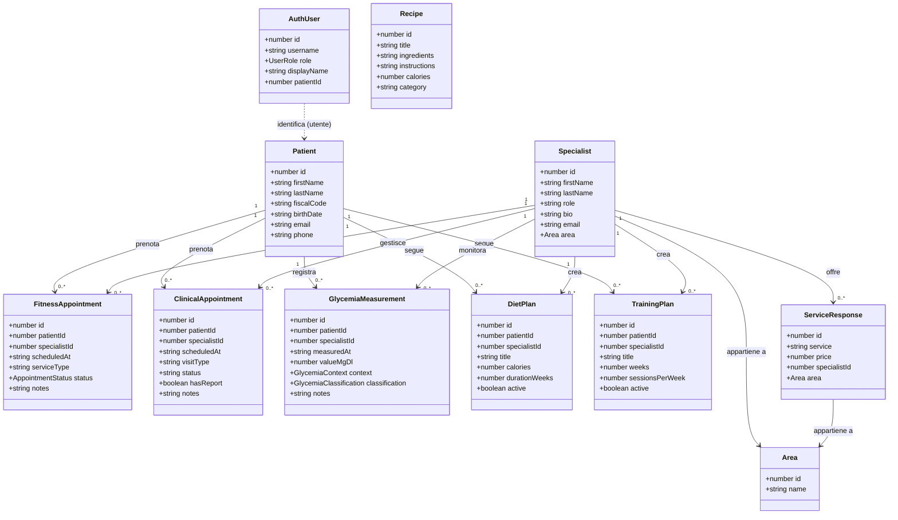

# Apice Clinic — Frontend

Applicazione web Angular 21 per la gestione di una clinica di medicina sportiva e nutrizione.  
Permette la prenotazione online di visite, il monitoraggio della glicemia, la gestione di piani dieta e allenamento, referti digitali e una dashboard amministrativa con KPI, grafici ricavi/appuntamenti e calendario.

## Tecnologie

- **Angular 21** — Standalone Components, Signals, Control Flow (`@if` / `@for`)
- **TypeScript** — strict mode
- **Tailwind CSS** — utility-first styling
- **ApexCharts** — grafici dashboard
- **Angular Material** — componenti UI
- **Flowbite** — componenti UI aggiuntivi (dropdown, modal, tooltip)

---

## Prerequisiti

- **Node.js** ≥ 18
- **npm** ≥ 9
- Il **backend** Spring Boot in esecuzione su `http://localhost:8080`

---

## Avvio in sviluppo

```bash
# Installa le dipendenze (solo la prima volta)
npm install

# Avvia il server di sviluppo con proxy verso il backend
npm start
```

L'applicazione sarà disponibile su **http://localhost:4200**.  
Il proxy reindirizza automaticamente le chiamate `/api/*` verso `http://localhost:8080`.

---

## Build

```bash
# Build standard (output in ../backend/src/main/resources/static)
npm run build

# Build di produzione ottimizzata
npm run build:prod
```

---

## Test

```bash
npm test
```

---

## Struttura delle pagine

### Pagine pubbliche (accessibili senza login)

| Percorso | Descrizione |
|---|---|
| `/homepage` | Pagina principale con widget di prenotazione online |
| `/specialists` | Elenco degli specialisti del centro |
| `/specialist/:slug` | Profilo del singolo specialista |
| `/services` | Servizi offerti dal centro |
| `/faq` | Domande frequenti |

### Pagine riservate agli utenti loggati

| Percorso | Descrizione |
|---|---|
| `/appointments` | I miei appuntamenti |
| `/reports` | I miei referti e documenti |
| `/recipes` | Ricette (solo visualizzazione; aggiunta/modifica/eliminazione riservata agli admin) |

### Pagine riservate agli amministratori

| Percorso | Descrizione |
|---|---|
| `/admin/dashboard` | Dashboard con KPI, grafici ricavi/appuntamenti filtrabili per periodo e distribuzione ricavi per area |
| `/patients` | Gestione pazienti |
| `/booking-calendar` | Calendario prenotazioni |
| `/glycemia` | Monitoraggio glicemia pazienti |
| `/nutrition` | Piani dieta |
| `/training` | Piani di allenamento |

---

## Navigazione (navbar)

### Utente loggato
Il menu utente espone: **I miei referti** → **I miei appuntamenti** → Esci.

### Amministratore
La navbar admin è organizzata in due dropdown:

- **Gestionale** — Pazienti, Appuntamenti, Referti, Calendario
- **Clinico** — Glicemia, Nutrizione, Sport

Le voci *Prestazioni* e *Specialisti* sono visibili solo agli utenti non-admin.

---

## Diagramma UML delle classi



---

## Note

- Le rotte protette richiedono autenticazione; senza login si viene reindirizzati automaticamente.
- Il frontend da solo non funziona senza il backend attivo (le API non rispondono).
